# Enterprise HQ Network

**Cisco Packet Tracer Enterprise Network Design & Implementation**

A portfolio project that demonstrates the design, implementation, security, and validation of a small-to-medium enterprise headquarters network for a fictional company, **TechSolutions**.

The network is designed to represent an organization of approximately **75 employees**, while using **12 client PCs** in Cisco Packet Tracer as a practical simulation.

---

## Project Highlights

- Hierarchical enterprise network design
- Department segmentation using VLANs
- Layer 3 switching and Inter-VLAN Routing
- Centralized DHCP, DNS, Web, NTP, and Syslog services
- Secure remote administration using SSH
- Access Control Lists (ACLs)
- Port Security with Sticky MAC
- Parking VLAN and unused-port hardening
- NAT/PAT at the network edge
- Centralized monitoring and logging
- End-to-end connectivity and security validation
- Professional technical documentation

---

## Network Architecture

The headquarters network follows a simplified hierarchical enterprise design:

```text
                         Cloud / Outside
                               |
                            EDGE-R1
                               |
                        10.10.10.0/24
                               |
                         HQ-CoreSW1
                        Layer 3 Core
                               |
                          802.1Q Trunk
                               |
                        HQ-AccessSW1
                 _____________|_____________
                |             |             |
               HR          Finance          IT
            VLAN 10        VLAN 20       VLAN 30

                         Guest VLAN 40

              Servers connect to the Core
                       VLAN 50
```

### Logical Topology

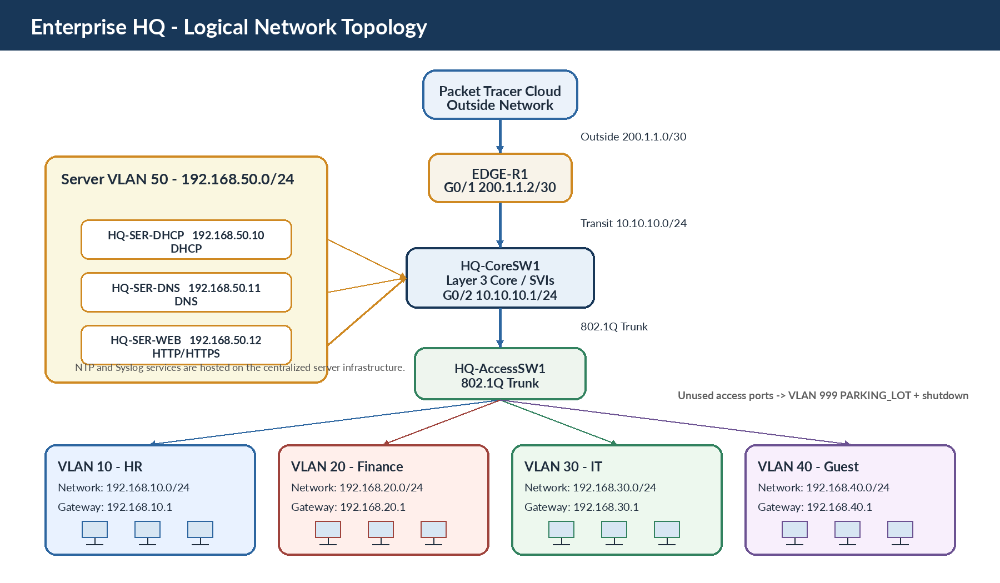

### Physical Topology

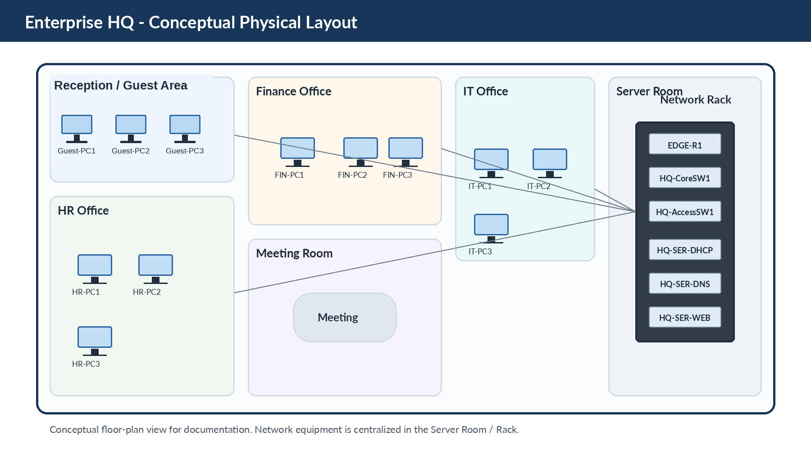

---

## Device Inventory

| Device | Quantity | Purpose |
|---|---:|---|
| Edge Router | 1 | NAT/PAT and external connectivity |
| Layer 3 Core Switch | 1 | Inter-VLAN routing and core switching |
| Layer 2 Access Switch | 1 | End-device connectivity and VLAN access |
| Servers | 3 | Centralized infrastructure services |
| Client PCs | 12 | HR, Finance, IT, and Guest users |

### Main Device Names

| Role | Device Name |
|---|---|
| Edge Router | `EDGE-R1` |
| Layer 3 Core Switch | `HQ-CoreSW1` |
| Access Switch | `HQ-AccessSW1` |
| DHCP Server | `HQ-SER-DHCP` |
| DNS Server | `HQ-SER-DNS` |
| Web Server | `HQ-SER-WEB` |

---

## VLAN & IP Addressing Plan

| VLAN | Department | Network | Default Gateway |
|---:|---|---|---|
| 10 | HR | `192.168.10.0/24` | `192.168.10.1` |
| 20 | Finance | `192.168.20.0/24` | `192.168.20.1` |
| 30 | IT | `192.168.30.0/24` | `192.168.30.1` |
| 40 | Guest | `192.168.40.0/24` | `192.168.40.1` |
| 50 | Servers | `192.168.50.0/24` | `192.168.50.1` |
| 999 | Parking | N/A | N/A |

### Access Port Assignment

| Access Switch Ports | VLAN | Department |
|---|---:|---|
| `Fa0/1 - Fa0/3` | 10 | HR |
| `Fa0/4 - Fa0/6` | 20 | Finance |
| `Fa0/7 - Fa0/9` | 30 | IT |
| `Fa0/10 - Fa0/12` | 40 | Guest |
| Unused ports | 999 | Parking VLAN |

---

## Layer 3 Switching

The Layer 3 Core Switch provides the default gateway for each VLAN using **Switched Virtual Interfaces (SVIs)** and performs internal routing using:

```text
ip routing
```

The Core also maintains a default route toward the Edge Router:

```text
0.0.0.0/0 via 10.10.10.2
```

### Verification

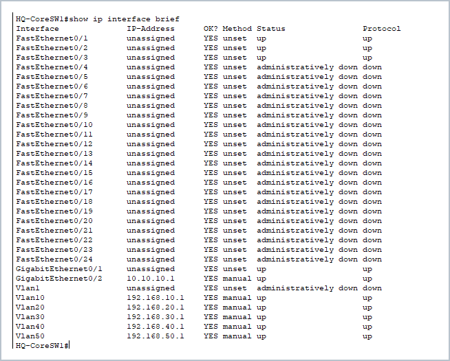

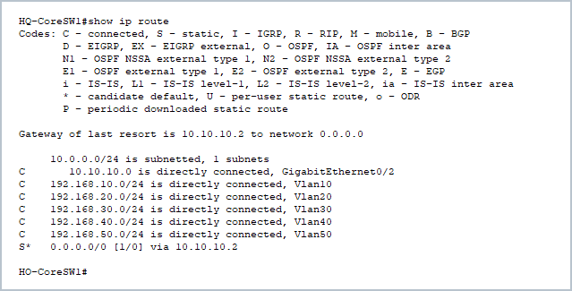

---

## Centralized Network Services

### DHCP

A dedicated DHCP server provides dynamic addressing for user VLANs.

**DHCP Server:** `192.168.50.10`

Example address pools:

| VLAN | DHCP Range |
|---|---|
| HR | `192.168.10.100 - 192.168.10.200` |
| Finance | `192.168.20.100 - 192.168.20.200` |
| IT | `192.168.30.100 - 192.168.30.200` |
| Guest | `192.168.40.100 - 192.168.40.200` |

DHCP Relay is implemented on the Core SVIs using:

```text
ip helper-address 192.168.50.10
```

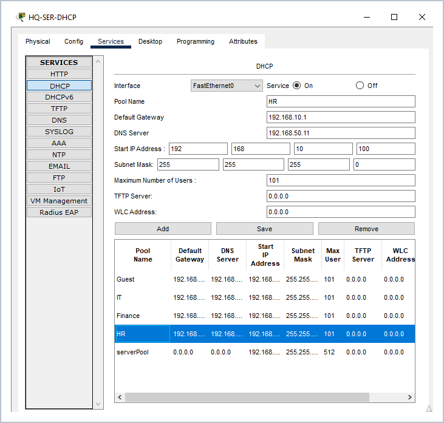

---

### DNS

**DNS Server:** `192.168.50.11`

The internal DNS server resolves:

```text
www.techsolutions.local
```

to:

```text
192.168.50.12
```

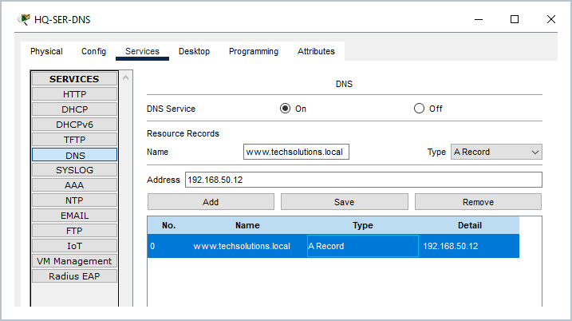

---

### Internal Web Server

**Web Server:** `192.168.50.12`

The internal website simulates an enterprise intranet and is accessible through:

```text
http://www.techsolutions.local
```

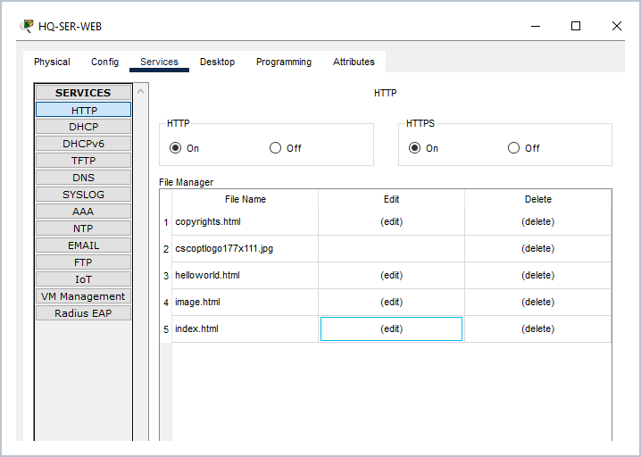

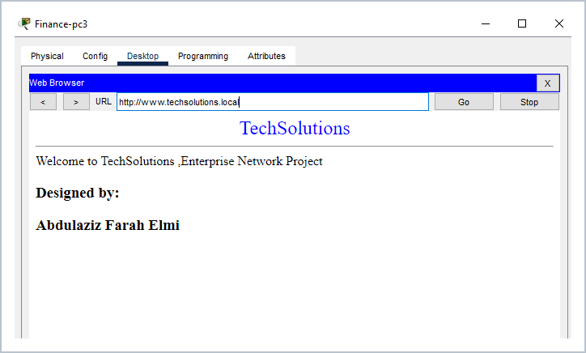

---

### NTP

A centralized NTP service is enabled to support consistent device time and improve log/event correlation.

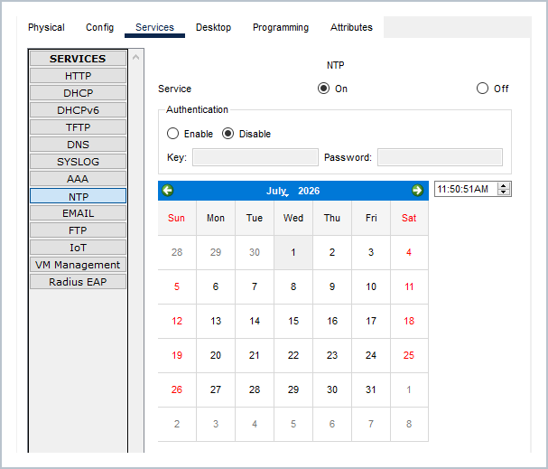

---

### Syslog

Centralized Syslog collects network events for monitoring, troubleshooting, and security visibility.

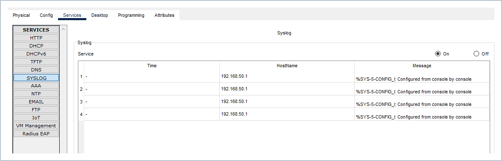

---

## Security Implementation

### SSH Remote Administration

Secure Shell is used instead of Telnet for encrypted remote device administration.

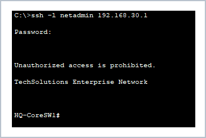

---

### Access Control Lists

Two main security policies are implemented on the Core:

#### HR Policy

- HR → IT: **Blocked**
- HR → Finance: **Allowed**
- HR → Servers: **Allowed**

#### Guest Policy

Guest users are isolated from internal enterprise networks:

- Guest → HR: **Blocked**
- Guest → Finance: **Blocked**
- Guest → IT: **Blocked**
- Guest → Servers: **Blocked**
- Other permitted traffic is allowed according to the configured policy.

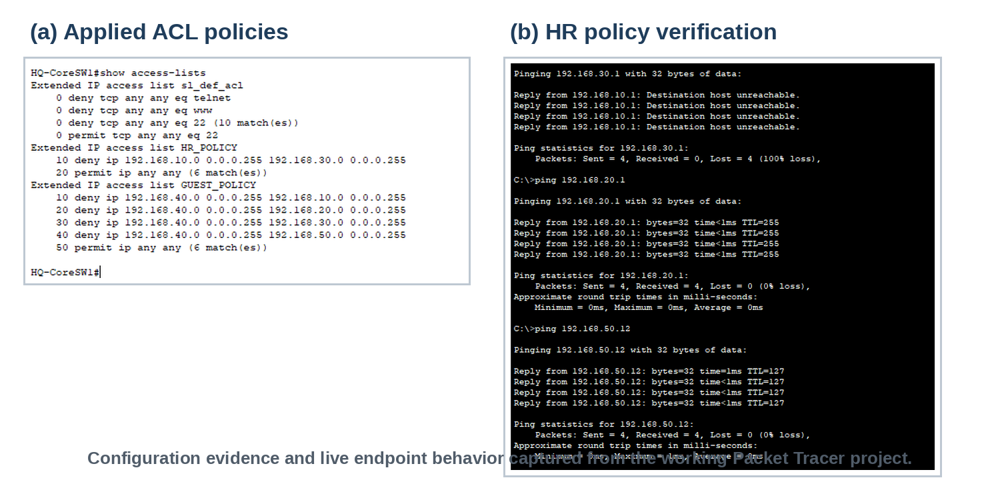

---

### Port Security

Port Security is applied to user-facing access ports with:

- Maximum secure MAC addresses: `1`
- Sticky MAC learning
- Violation mode: `shutdown`

Normal operation:

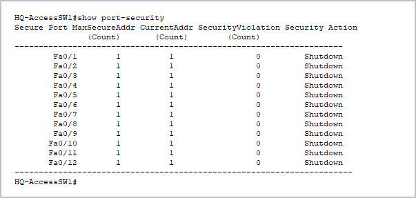

Violation test:

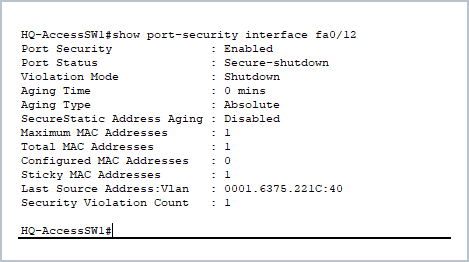

---

### Parking VLAN & Unused Port Hardening

Unused access ports are placed in **VLAN 999 (`PARKING_LOT`)** and administratively disabled to reduce the attack surface.

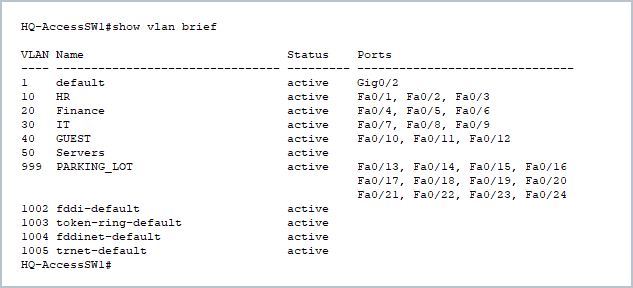

---

## Trunking

The link between `HQ-AccessSW1` and `HQ-CoreSW1` uses **IEEE 802.1Q trunking** to transport multiple VLANs between the access and core layers.

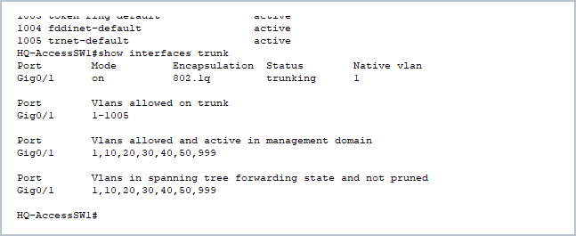

---

## NAT / PAT

`EDGE-R1` provides NAT/PAT for internal private networks.

### NAT Roles

- `GigabitEthernet0/0` → NAT Inside
- `GigabitEthernet0/1` → NAT Outside

PAT configuration uses the outside interface address:

```text
ip nat inside source list 1 interface GigabitEthernet0/1 overload
```

The NAT ACL permits the enterprise private address space:

```text
192.168.0.0/16
```

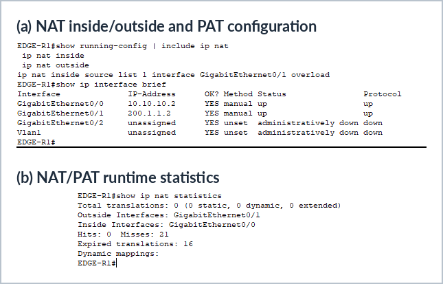

> **Packet Tracer note:** the simulated Cloud is used to represent the external network boundary and is not treated as a fully functional public Internet endpoint. NAT/PAT is therefore documented through configuration and router statistics rather than claimed as real Internet connectivity.

---

## Validation & Testing

The project was validated through functional and security tests.

| Test | Result |
|---|---|
| DHCP address assignment | ✅ Pass |
| DNS name resolution | ✅ Pass |
| Internal HTTP access | ✅ Pass |
| Inter-VLAN routing | ✅ Pass |
| SSH remote login | ✅ Pass |
| HR ACL enforcement | ✅ Pass |
| Port Security | ✅ Pass |
| Syslog logging | ✅ Pass |
| NTP service availability | ✅ Verified |
| NAT/PAT configuration | ✅ Verified |

### End-to-End Connectivity

An IT workstation with an address in `192.168.30.0/24` successfully reached authorized destinations in other VLANs.

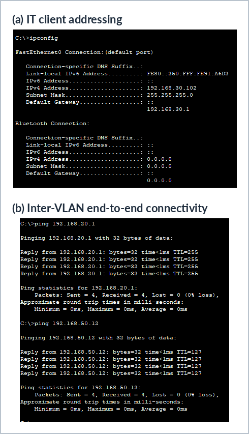

---

## Troubleshooting Experience

This project also included practical troubleshooting scenarios.

### Configuration Loss

**Issue:** Packet Tracer was closed before the running configuration was saved.

**Resolution:** Devices were reconfigured and configurations were saved using:

```text
copy running-config startup-config
```

**Lesson:** configuration backups and regular saves are critical.

### Port Security Violation

**Issue:** connecting a different device to a secured port triggered a shutdown condition.

**Resolution:** the violation was identified and the port was recovered after troubleshooting.

**Lesson:** Sticky MAC and violation modes actively protect access ports.

### SSH Troubleshooting

**Issue:** remote SSH access initially failed.

**Resolution:** SSH prerequisites including hostname, domain name, RSA keys, local authentication, and VTY configuration were verified.

**Lesson:** SSH depends on multiple configuration components working together.

### DHCP Troubleshooting

**Issue:** clients initially failed to receive the expected network parameters.

**Resolution:** DHCP scope settings and gateway configuration were corrected and client leases renewed.

---

## Skills Demonstrated

This project demonstrates hands-on experience with:

- Cisco IOS CLI
- Enterprise network design
- VLANs and trunking
- Layer 3 switching
- Inter-VLAN routing
- SVIs
- Static/default routing
- DHCP and DHCP Relay
- DNS
- HTTP services
- SSH
- ACLs
- Port Security
- Sticky MAC
- Network hardening
- NAT/PAT
- NTP
- Syslog
- Connectivity verification
- Network troubleshooting
- Technical documentation

---

## Project Files

```text
Enterprise-HQ-Network/
│
├── README.md
├── Enterprise-HQ-Network.pkt
├── Enterprise-HQ-Network-Report.pdf
│
├── Configurations/
│   ├── EDGE-R1.txt
│   ├── HQ-CoreSW1.txt
│   └── HQ-AccessSW1.txt
│
└── Images/
    ├── 01-Physical-Topology.png
    ├── 02-Logical-Topology.png
    ├── 03-VLAN-Configuration.png
    ├── 04-Trunk-Configuration.png
    ├── 05-Layer3-Interface-Status.png
    ├── 06-Routing-Table.png
    ├── 07-DHCP-Server-Configuration.png
    ├── 08-DNS-Server-Configuration.png
    ├── 09-Web-Server-Configuration.png
    ├── 10-Internal-Website-Access.png
    ├── 11-NTP-Server-Configuration.png
    ├── 12-Syslog-Server-Logs.png
    ├── 13-SSH-Remote-Login.png
    ├── 14-ACL-Configuration-and-Verification.png
    ├── 15-Port-Security-Status.png
    ├── 16-Port-Security-Violation.png
    ├── 17-NAT-PAT-Configuration-and-Statistics.png
    └── 18-End-to-End-Connectivity-Test.png
```

---

## Full Technical Report

For the complete design rationale, implementation details, screenshots, testing results, troubleshooting notes, and future improvements:

**[View the full Enterprise HQ Network Report](Enterprise-HQ-Network-Report.pdf)**

---

## Project Roadmap

This repository represents **Project 1** of a three-stage enterprise networking portfolio.

### Project 1 — Enterprise HQ
**Completed**

- VLANs
- Layer 3 Switching
- Centralized Services
- Security Controls
- NAT/PAT
- Monitoring

### Project 2 — HQ + Branch
**Planned**

- Branch Office
- WAN connectivity
- VLSM
- OSPF
- DHCP Relay expansion
- Inter-site ACL policies

### Project 3 — Enterprise Expansion
**Planned**

- RSTP
- EtherChannel
- Gateway redundancy
- DHCP Snooping
- Advanced security
- Larger enterprise architecture
- VPN where supported

---

## About This Project

This project was built as part of a structured self-learning path in **network engineering and cybersecurity**.

The objective was not only to configure Cisco technologies, but to understand the engineering decisions behind the design, validate the implementation, troubleshoot real configuration issues, and document the final environment professionally.

---

## Author

**Abdulaziz Farah Elmi**

Network Engineering & Cybersecurity Portfolio Project

---

> This project is a lab simulation created for educational and portfolio purposes using Cisco Packet Tracer.

## Copyright

© 2026 Abdulaziz Farah Elmi. All rights reserved.

This project is published for portfolio and educational viewing purposes only.

Reuse, redistribution, modification, or submission of this project as another person's own work is not permitted without prior permission from the author.
